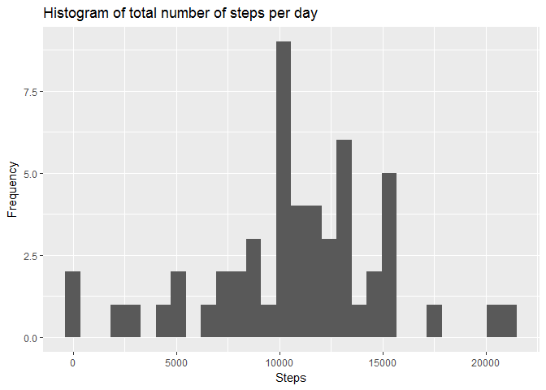
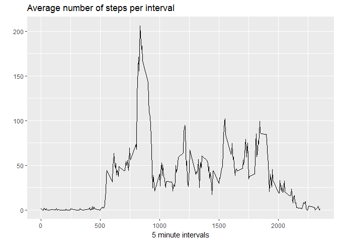
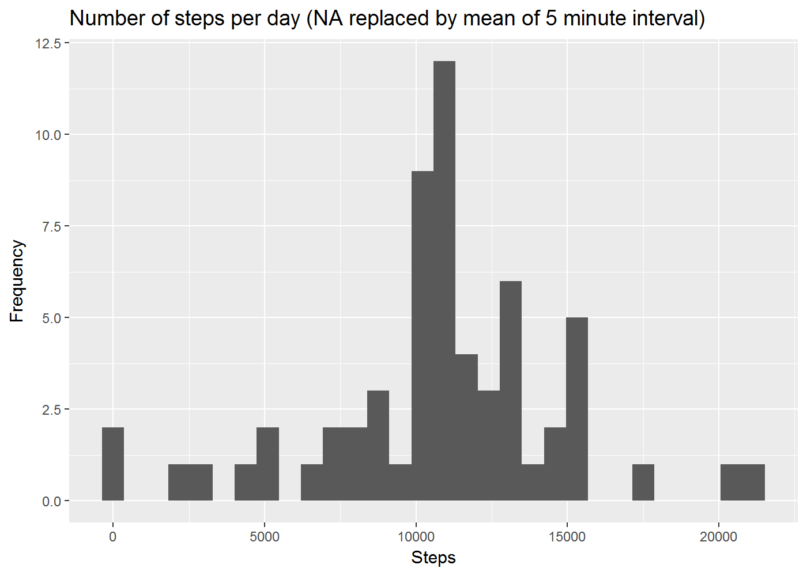
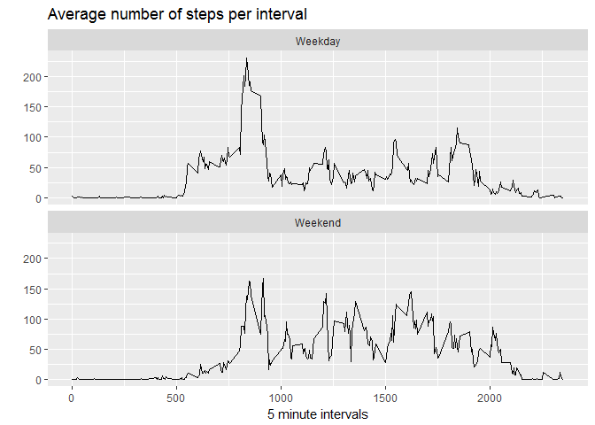

# Reproducible Research: Peer Assessment 1
datatrainR  


## SETUP


```r
setwd("E:/Lukas/Coursera/Data Specialization/RepResearch/RepData_PeerAssessment1/")
require(data.table)
```

```
## Loading required package: data.table
```

```r
require(ggplot2)
```

```
## Loading required package: ggplot2
```

```
## Warning: package 'ggplot2' was built under R version 3.3.3
```

## GETTING DATA

```r
coursedata <- "https://d396qusza40orc.cloudfront.net/repdata%2Fdata%2Factivity.zip"
download.file(url = coursedata, destfile = "zippeddata.zip", method = "auto")
unzip("zippeddata.zip")
activitydat <- read.csv("activity.csv")
```

For large datasets, I like to use data.table, and it will come in handy to format date as an actual date class

```r
activitytable <- data.table(activitydat)
activitytable[, date := as.Date(date, format="%Y-%m-%d")]
```

Let's get a first overview of how our data looks like

```r
activitysummary <- summary(activitytable[,steps])
activitysummary
```

```
##    Min. 1st Qu.  Median    Mean 3rd Qu.    Max.    NA's 
##    0.00    0.00    0.00   37.38   12.00  806.00    2304
```


## 1. The total steps per day in a histogram
Aggregating using "sum" over dates yields steps per day. 


```r
stepspday <- setNames(aggregate(activitytable[,steps], by=list(activitytable[,date]), sum), list("date", "steps"))
stepssummary <- summary(stepspday$steps)

qplot(stepspday[,"steps"], geom="histogram") +
        ylab("Frequency") + xlab('Steps')+
        ggtitle('Histogram of total number of steps per day')
```

```
## `stat_bin()` using `bins = 30`. Pick better value with `binwidth`.
```

```
## Warning: Removed 8 rows containing non-finite values (stat_bin).
```

<!-- -->

On average 1.077\times 10^{4} were made each day (median: 1.076\times 10^{4} steps ) 

## 2. Aggregating 5 minute intervals over all days


```r
stepspinterval <- setNames(aggregate(activitytable[,steps], by=list(activitytable[,interval]), FUN = mean, na.rm = TRUE), list("interval", "steps"))
moststeps <- stepspinterval$interval[which.max(stepspinterval$steps)]

ggplot(stepspinterval, aes(interval, steps)) + geom_line() +
        xlab("5 minute intervals") + ylab("") +
        ggtitle('Average number of steps per interval')
```

<!-- -->

Across all days, the most steps were taken at 835.

## 3. Fill NAs

As our summary table at the beginning revealed, theres a total of 2304 NAs in this dataset.  
I suggest we will them with means for their respective 5 minute intervals:


```r
activitytable[, stepsfilled := steps]

for(i in 1:nrow(activitytable)){
        if (is.na(activitytable$stepsfilled[i])==TRUE){
                activitytable$stepsfilled[i]=stepspinterval$steps[which(stepspinterval$interval==activitytable$interval[i])]
        }
}
```

Unfortunately, I haven't found a sexy solution using data.table commands.  
Again, we can aggregate and plot this.


```r
stepspday_filled <- setNames(aggregate(activitytable[,stepsfilled], by=list(activitytable[,date]), sum), list("date", "stepsfilled"))

qplot(stepspday_filled[,"stepsfilled"], geom="histogram") +
        ylab("Frequency") + xlab('Steps')+
        ggtitle('Number of steps per day (NA replaced by mean of 5 minute interval)')
```

```
## `stat_bin()` using `bins = 30`. Pick better value with `binwidth`.
```



As was to be expected when filling with means and aggregating again over time-intervals, there is hardly any difference to the non-filled data:

```r
summary(stepspday_filled$stepsfilled)
```

```
##    Min. 1st Qu.  Median    Mean 3rd Qu.    Max. 
##      41    9819   10770   10770   12810   21190
```

```r
summary(stepspday$steps)
```

```
##    Min. 1st Qu.  Median    Mean 3rd Qu.    Max.    NA's 
##      41    8841   10760   10770   13290   21190       8
```

## 4. Weekend vs Weekdays

Using the weekdays function we classify our dates and aggregate again, but this time creating a weekend-indicator.


```r
activitytable[, weekend := weekdays(date)%in% c("Samstag", "Sonntag")]
activitytable[, weekend := factor(activitytable$weekend, labels=c("Weekday", "Weekend"))]

stepspinterval2 <- setNames(aggregate(activitytable[,stepsfilled], by=list(activitytable[,interval],activitytable[,weekend]), FUN = mean), list("interval", "weekend","steps"))
```

Finally, we make use of the facet_wrap functionality of ggplot to create this graph.


```r
ggplot(stepspinterval2, aes(interval, steps)) + geom_line() +
        facet_wrap(~weekend, ncol = 1) +
        xlab("5 minute intervals") + ylab("") +
        ggtitle('Average number of steps per interval')
```

<!-- -->

While the daily commute to work brings along a peak in steps on workday-mornings, there seems to be more overall activity spread throughout the day on weekends. 
